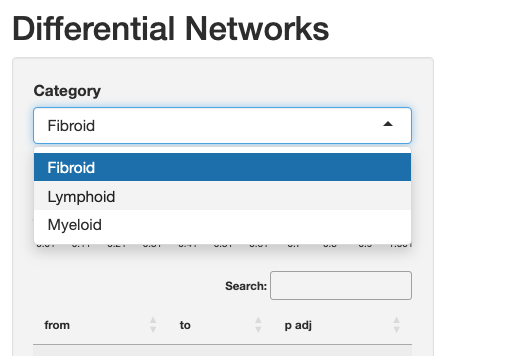
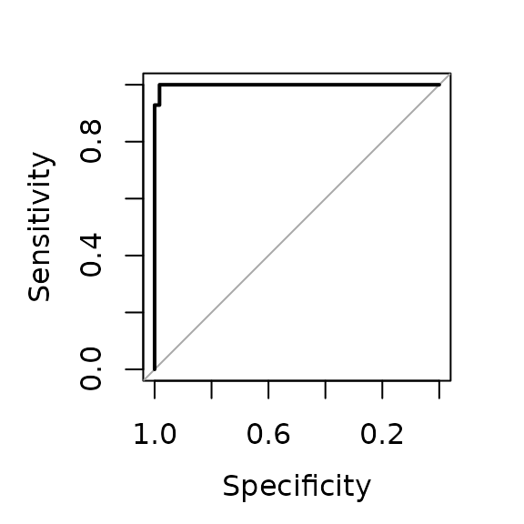

# Differential Network Analysis with multiDEGGs

## Introduction

The multiDEGGs package performs multi-omic differential network analysis
by identifying differential interactions between molecular entities
(genes, proteins, miRNAs, or other biomolecules) across the omic
datasets provided.

For each omic dataset, a differential network is constructed, where
links represent statistically significant differential interactions
between entities. These networks are then integrated into a
comprehensive visualization using distinct colors to distinguish
interactions from different omic layers. This unified visualization
allows interactive exploration of cross-omic patterns (e.g.,
differential interactions present at both transcript and protein level).
For each link, users can access differential statistical significance
metrics (p-values or adjusted p-values, calculated via robust or
traditional linear regression with interaction term), and differential
regression plots.

Beyond network visualization and exploration, multiDEGGs extends its
utility into predictive modeling applications. The identified
differential interactions can be leveraged as engineered features in
machine learning pipelines, providing biologically meaningful predictors
that capture relational information between molecular entities. The
package includes specialized functions for nested cross-validation that
ensure proper feature selection and engineering without data leakage,
enabling the construction of robust and interpretable predictive models.

## Installation

Install from CRAN:  
`install.packages("multiDEGGs")`

Install from Github:  
`devtools::install_github("elisabettasciacca/multiDEGGs")`

## Quick start - Generate Differential Networks

Let’s start by loading the package and sample data:

``` r
library(multiDEGGs)
data("synthetic_metadata")
data("synthetic_rnaseqData")
data("synthetic_proteomicData")
data("synthetic_OlinkData")
```

Generate Differential Networks:

``` r
assayData_list <- list("RNAseq" = synthetic_rnaseqData,
                       "Proteomics" = synthetic_proteomicData,
                       "Olink" = synthetic_OlinkData)

deggs_object <- get_diffNetworks(assayData = assayData_list,
                                 metadata = synthetic_metadata,
                                 category_variable = "response",
                                 regression_method = "lm",
                                 padj_method = "bonferroni",
                                 verbose = FALSE,
                                 show_progressBar = FALSE,
                                 cores = 2)
```

### Key Parameters of `get_diffNetworks`

It’s worth explaining some of the important parameters of
`get_diffNetworks`:

- `assayData`: accepts either a single normalized matrix/data frame (for
  single omic differential analysis), or a list of matrices/data frames
  (for multi-omic scenarios). For multi-omic analysis, it’s highly
  recommended to use a named list of data. If unnamed, sequential names
  (assayData1, assayData2, etc.) will be assigned to identify each
  matrix or data frame.

- `metadata`: can also be a named factor vector, with names matching the
  patient IDs in column names of the assay data matrices/data frames. In
  that case, the category_variable can remain unset (NULL by default).

- `category_subset`: this parameter can restrict the analysis to a
  certain subset of categories available in the metadata/category
  vector.

- `regression_method`: set to `"lm"` by default because it is faster and
  highly recommended in machine learning scenarios, where the function
  might be repeatedly called many times. For basic differential
  analyses, `"rlm"` can also be used and may perform better in some
  cases.

- `percentile_vector`: by default, molecular targets (genes, proteins,
  etc.) whose expression level is below the 35th percentile of the
  entire data matrix are excluded from the analysis. This threshold can
  be modified by specifying the percentile vector that is internally
  used for the percolation analysis. For example, to remove only targets
  below the 25th percentile, set
  `percentile_vector = seq(0.25, 0.98, by = 0.05)`.

- `padj_method`: the default method is Bonferroni. Storey’s q values
  often give more generous results but the `qvalue` package needs to be
  installed first.

**NOTE**: Not all patient IDs need to be present across datasets.
Different numbers of samples per omic are acceptable. Only IDs whose
data is available in the colnames of the assayData will be included in
the analysis. Missing IDs will be listed in a message similar to:

`The following samples IDs are missing in Proteomics: PT001, PT005, PT0030`

## Visualization

The `deggs_object` now contains the differential networks for each omic
data in `assayData_list`. These networks can be integrated into a
comprehensive visualization where different colors distinguish links
from different omic layers.

``` r
View_diffNetworks(deggs_object)
```

This visualization interface allows you to:

1.  Navigate the networks associated with each patient category
2.  Filter by link significance
3.  Search for specific genes inside the network

 


 

Thicker links correspond to higher significant p-values.  
The direction of the arrows shows the relationship direction reported in
literature, not derived from the data.

The user can visualize differential regression plots by clicking on a
link:

 


 

Single node differential expressions can also be visualized by clicking
on the nodes:

 


 

**NOTE**: For multi-omic scenarios, the data from the first matrix in
the list passed to `assayData` will be used for this boxplot.

## List All Differential Interactions

Outside of the interactive environment, the
[`get_multiOmics_diffNetworks()`](https://elisabettasciacca.github.io/multiDEGGs/reference/get_multiOmics_diffNetworks.md)
function can be used to get a table of all differential interactions,
ordered by p-value or adjusted p-value:

``` r
get_multiOmics_diffNetworks(deggs_object, sig_threshold = 0.05)
#> $Non_responder
#>                  from       to      p.value        p.adj      layer
#> TNF-TNFRSF1A      TNF TNFRSF1A 3.325023e-04 1.330009e-03     RNAseq
#> IL1B-IL1R2       IL1B    IL1R2 5.389195e-04 2.155678e-03     RNAseq
#> TGFB3-TGFBR1    TGFB3   TGFBR1 5.329071e-15 2.131628e-14     RNAseq
#> AKT2-MTOR        AKT2     MTOR 4.347083e-04 1.738833e-03     RNAseq
#> FANCD2-FAN1    FANCD2     FAN1 4.440892e-16 3.552714e-15 Proteomics
#> GNG12-RASA2     GNG12    RASA2 0.000000e+00 0.000000e+00 Proteomics
#> RASGRP3-RRAS  RASGRP3     RRAS 2.202344e-04 1.761875e-03 Proteomics
#> TNF-TNFRSF1A1     TNF TNFRSF1A 0.000000e+00 0.000000e+00 Proteomics
#> RASGRP1-RAP1A RASGRP1    RAP1A 2.840564e-03 2.272452e-02 Proteomics
#> 
#> $Responder
#>                from    to      p.value        p.adj  layer
#> FANCD2-FAN1  FANCD2  FAN1 0.000000e+00 0.000000e+00 RNAseq
#> FASLG-FAS     FASLG   FAS 6.947839e-07 2.084352e-06 RNAseq
#> MAP2K2-MAPK3 MAP2K2 MAPK3 1.153300e-12 3.459899e-12 RNAseq
```

For single omic scenarios, use the
[`get_sig_deggs()`](https://elisabettasciacca.github.io/multiDEGGs/reference/get_sig_deggs.md)
function:

``` r
deggs_object_oneOmic <- get_diffNetworks(assayData = synthetic_rnaseqData,
                                 metadata = synthetic_metadata,
                                 category_variable = "response",
                                 regression_method = "lm",
                                 padj_method = "bonferroni",
                                 verbose = FALSE,
                                 show_progressBar = FALSE,
                                 cores = 2)

get_sig_deggs(deggs_object_oneOmic, sig_threshold = 0.05)
#>                              from       to      p.value        p.adj
#> Non_responder.TNF-TNFRSF1A    TNF TNFRSF1A 3.325023e-04 1.330009e-03
#> Non_responder.IL1B-IL1R2     IL1B    IL1R2 5.389195e-04 2.155678e-03
#> Non_responder.TGFB3-TGFBR1  TGFB3   TGFBR1 5.329071e-15 2.131628e-14
#> Non_responder.AKT2-MTOR      AKT2     MTOR 4.347083e-04 1.738833e-03
#> Responder.FANCD2-FAN1      FANCD2     FAN1 0.000000e+00 0.000000e+00
#> Responder.FASLG-FAS         FASLG      FAS 6.947839e-07 2.084352e-06
#> Responder.MAP2K2-MAPK3     MAP2K2    MAPK3 1.153300e-12 3.459899e-12
```

## Differential Regression Plots

To plot the differential regression fits outside of the interactive
environment, use
[`plot_regressions()`](https://elisabettasciacca.github.io/multiDEGGs/reference/plot_regressions.md)
specifying the omic data to be used and the two targets:

``` r
plot_regressions(deggs_object,
                 assayDataName = "RNAseq",
                 gene_A = "MTOR", 
                 gene_B = "AKT2",
                 legend_position = "bottomright")
```

 


In single omic analyses, the `assayDataName` parameter can remain unset.

## Differential Network Analysis with More Than Two Groups

It’s possible to compare differential interactions among more than two
categorical groups. All steps described above stay the same;  
the dropdown menu of the interactive environment will show all available
categories:

|                       |
|-----------------------|
|  |

While regressions and boxplots will show all categories:

|                       |                       |
|-----------------------|-----------------------|
|  |  |

The statistical significance of the interaction term is calculated via
one-way ANOVA in this case.  
We highly recommend to have at least 4 or 5 observations per group.

## Feature Selection and Engineering with multiDEGGs in Nested Cross-Validation

In computational biology applications involving high-throughput data,
researchers commonly encounter situations where the number of potential
predictors far exceeds the available sample size. This dimensional
challenge requires careful feature selection strategies for both
mathematical and clinical reasons.

Standard feature selection methods typically evaluate predictors
individually, identifying those variables that show the strongest
univariate associations with the outcome variable (such as through
t-tests or Wilcoxon tests). While effective, this approach overlooks the
interconnected nature of biological systems, where

Feature engineering represents a complementary strategy that creates new
predictors by combining or transforming existing variables. In biology,
such approach can be used to capture higher-order information that
reflects the interconnected nature of molecular processes. For instance,
the ratio between two genes may provide more discriminative power than
either gene expression level independently, particularly when their
relative balance is disrupted in disease states.

The informative content encoded in differential interactions, combined
with multiDEGGs’ ability to identify only literature-validated
differential relationships, makes it particularly well-suited for both
individual feature selection and guided creation of engineered
predictors in machine learning. Such approach has potential to overcome
the limitations of conventional algorithms which may select individual
predictors without clear biological significance, compromising both the
interpretability and clinical credibility of the resulting models.

### Why Nested Cross-Validation for Feature Engineering?

It is crucial that feature selection and modification is conducted
exclusively on training data within cross-validation loops to prevent
information leakage from the test set. The `nestedcv` package enables
the nested modification of predictors within each outer fold, ensuring
that the attributes learned from the training part are applied to the
test data without prior knowledge of the test data itself.  
The selected and combined features, and corresponding model, can then be
evaluated on the hold-out test data without introducing bias.

Both (nestcv.glmnet) and (nestcv.train) from `nestedcv` accept any
user-defined function that filters or transforms the feature matrix by
passing the function name to the `modifyX` parameter.  
**The multiDEGGs package provides two specialized functions for this
purpose.**

### multiDEGGs_filter(): Pure Differential Network-Based Selection

The
[`multiDEGGs_filter()`](https://elisabettasciacca.github.io/multiDEGGs/reference/multiDEGGs_filter.md)
function performs feature selection based entirely on differential
network analysis. It identifies significant differential molecular
interactions and can return either the interaction pairs alone or both
pairs and individual variables involved in those interactions.

#### Key Parameters

When using
[`multiDEGGs_filter()`](https://elisabettasciacca.github.io/multiDEGGs/reference/multiDEGGs_filter.md),
you can control the following parameters through `modifyX_options`:

- **`keep_single_genes`** (logical, default `FALSE`): Controls whether
  to include individual genes from significant pairs in addition to the
  pairs themselves
- **`nfilter`** (integer, default `NULL`): Maximum number of predictors
  to return. When `NULL`, all significant interactions found are
  included

#### Usage Examples

##### Basic Usage: Pairs Only

``` r
library(nestedcv)
data("synthetic_metadata")
data("synthetic_rnaseqData")

# Regularized linear model with interaction pairs only
fit.glmnet <- nestcv.glmnet(
  y = as.numeric(synthetic_metadata$response),
  x = t(synthetic_rnaseqData),
  modifyX = "multiDEGGs_filter",
  modifyX_options = list(
    keep_single_genes = FALSE,
    nfilter = 20
  ),
  modifyX_useY = TRUE,
  n_outer_folds = 5,
  n_inner_folds = 6,
  verbose = FALSE
)

summary(fit.glmnet)
#> Nested cross-validation with glmnet
#> No filter
#> Modifier:  multiDEGGs_filter 
#> Outer loop:  5-fold CV
#> Inner loop:  6-fold CV
#> 100 observations, 14 predictors
#> 
#>        alpha  lambda n.filter
#> Fold 1   0.2 0.16011        7
#> Fold 2   0.1 0.07423        7
#> Fold 3   0.1 0.14076        7
#> Fold 4   0.1 0.13511        7
#> Fold 5   1.0 0.15091        7
#> 
#> Final parameters:
#>  lambda    alpha  
#> 0.07099  0.10000  
#> 
#> Final coefficients:
#>  (Intercept) TNF:TNFRSF1A    AKT2:MTOR   IL1B:IL1R2    FASLG:FAS TGFB3:TGFBR1 
#>     1.808953    -0.188626    -0.113628     0.050012    -0.034766    -0.030783 
#> MAP2K2:MAPK3  FANCD2:FAN1 
#>    -0.020656    -0.008568 
#> 
#> Result:
#>        RMSE     R.squared   Pearson.r^2           MAE   
#>     0.48505       0.03419       0.04929       0.46076
```

##### Including Individual Genes (keep_single_genes = TRUE)

``` r
# Random forest model including both pairs and individual genes
fit.rf <- nestcv.train(
  y = synthetic_metadata$response,
  x = t(synthetic_rnaseqData),
  method = "rf",
  modifyX = "multiDEGGs_filter",
  modifyX_options = list(
    keep_single_genes = TRUE,
    nfilter = 30
  ),
  modifyX_useY = TRUE,
  n_outer_folds = 5,
  n_inner_folds = 6,
  verbose = FALSE
)
#> Loading required package: ggplot2
#> Loading required package: lattice

fit.rf$summary
#>                Reference
#> Predicted       Non_responder Responder
#>   Non_responder            57         1
#>   Responder                 1        41
#> 
#>               AUC            Accuracy   Balanced accuracy   
#>            0.9988              0.9800              0.9795

# Plot ROC on outer folds
plot(fit.rf$roc)
```



#### How nfilter works with keep_single_genes

- When **`keep_single_genes = FALSE`**: `nfilter` limits only the number
  of interaction pairs returned
- When **`keep_single_genes = TRUE`**: `nfilter` limits the combined
  count of unique individual genes plus interaction pairs. The function
  prioritizes pairs by significance and adds individual genes as needed
  until the limit is reached

### multiDEGGs_combined_filter(): Hybrid Statistical and Network-Based Selection

The
[`multiDEGGs_combined_filter()`](https://elisabettasciacca.github.io/multiDEGGs/reference/multiDEGGs_combined_filter.md)
function combines traditional statistical feature selection with
differential network analysis. This hybrid approach allows you to
benefit from both conventional univariate selection methods and the
biological insights from interaction analysis.

#### Key Parameters

- **`filter_method`** (character): Statistical method for single feature
  selection.  
  Options: `"ttest"`, `"wilcoxon"`, `"ranger"`, `"glmnet"`, `"pls"`
- **`nfilter`** (integer): Maximum number of features to select
- **`dynamic_nfilter`** (logical): Controls how `nfilter` is applied
  (see detailed explanation below)
- **`keep_single_genes`** (logical): When `dynamic_nfilter = TRUE`,
  determines whether to include individual genes from multiDEGGs pairs

#### Dynamic vs. Balanced Selection Modes

##### Dynamic Selection (`dynamic_nfilter = TRUE`)

In dynamic mode, the function: 1. Selects `nfilter` single genes using
the chosen statistical method 2. Adds ALL significant interaction pairs
found by multiDEGGs 3. Total predictors = `nfilter` single genes +
number of significant pairs

This mode allows the feature space to expand based on the biological
complexity discovered in each fold.

``` r
# Dynamic selection with t-test for single genes
fit.dynamic <- nestcv.glmnet(
  y = as.numeric(synthetic_metadata$response),
  x = t(synthetic_rnaseqData),
  modifyX = "multiDEGGs_combined_filter",
  modifyX_options = list(
    filter_method = "ttest", 
    nfilter = 20,
    dynamic_nfilter = TRUE, 
    keep_single_genes = FALSE
  ),
  modifyX_useY = TRUE,
  n_outer_folds = 5,
  n_inner_folds = 6,
  verbose = FALSE
)
```

##### Balanced Selection (`dynamic_nfilter = FALSE`)

In balanced mode, the function:  
1. Allocates approximately half of `nfilter` to interaction pairs  
2. Fills remaining slots with single genes from the statistical filter  
3. Maintains consistent total number of predictors across all folds

This mode ensures a fixed feature space size while balancing single
genes and interactions.

``` r
# Balanced selection with Wilcoxon-test importance
fit.balanced <- nestcv.train(
  y = synthetic_metadata$response,
  x = t(synthetic_rnaseqData),
  method = "rf",
  modifyX = "multiDEGGs_combined_filter",
  modifyX_options = list(
    filter_method = "wilcoxon", 
    nfilter = 40,
    dynamic_nfilter = FALSE
  ),
  modifyX_useY = TRUE,
  n_outer_folds = 5,
  n_inner_folds = 6,
  verbose = FALSE
)
```

#### Available Statistical Methods

- **`"ttest"`**: Two-sample t-test for differential expression
- **`"wilcoxon"`**: Wilcoxon rank-sum test (non-parametric alternative
  to t-test)
- **`"ranger"`**: Random Forest variable importance scoring (the
  `ranger` package must be installed first)
- **`"glmnet"`**: Elastic net regularization coefficients
- **`"pls"`**: Partial Least Squares variable importance

### Practical considerations

Before implementing multiDEGGs in your machine learning pipeline, it’s
highly recommended to first run a preliminary analysis on your complete
dataset to assess the number of differential interactions detected. This
exploratory step can guide your choice of approach and parameter
settings.

If multiDEGGs identifies only a small number of differential
interactions (e.g., fewer than 10-20 pairs), these features alone may
lack sufficient predictive power. In such cases, consider:

- Using
  [`multiDEGGs_combined_filter()`](https://elisabettasciacca.github.io/multiDEGGs/reference/multiDEGGs_combined_filter.md)
  to integrate network-based features with traditional statistical
  selection methods
- Setting `keep_single_genes = TRUE` in
  [`multiDEGGs_filter()`](https://elisabettasciacca.github.io/multiDEGGs/reference/multiDEGGs_filter.md)
  to include individual genes involved in the differential pairs
- Adjusting the `percentile_vector` or significance thresholds in the
  initial multiDEGGs analysis to potentially capture more interactions

Conversely, if a large number of differential interactions are detected,
[`multiDEGGs_filter()`](https://elisabettasciacca.github.io/multiDEGGs/reference/multiDEGGs_filter.md)
alone may provide sufficient feature diversity for effective model
training.

### Feature Engineering Details

Both functions create ratio-based features from significant gene pairs
(Gene A / Gene B), which capture the relative expression relationships
that drive differential network connectivity. The `predict` methods
automatically handle the feature transformation for both training and
test data within each cross-validation fold, ensuring no information
leakage.

**Note:** If no significant differential interactions are found in a
particular fold, both functions automatically fall back to t-test-based
selection to ensure robust performance across all scenarios. This
fallback is indicated by a printed “0” during execution.

## Citation

``` r
citation("multiDEGGs")
#> To cite package 'multiDEGGs' in publications use:
#> 
#>   Sciacca E, et al. (2023). "DEGGs: An R package with shiny app for the
#>   identification of differentially expressed gene-gene interactions in
#>   high-Throughput sequencing data." _Bioinformatics_, *39*, btad192.
#>   doi:10.1093/bioinformatics/btad192
#>   <https://doi.org/10.1093/bioinformatics/btad192>.
#> 
#> A BibTeX entry for LaTeX users is
#> 
#>   @Article{,
#>     title = {DEGGs: An R package with shiny app for the identification of differentially expressed gene-gene interactions in high-Throughput sequencing data},
#>     author = {Elisabetta Sciacca and {et al.}},
#>     journal = {Bioinformatics},
#>     year = {2023},
#>     volume = {39},
#>     pages = {btad192},
#>     doi = {10.1093/bioinformatics/btad192},
#>   }
```
